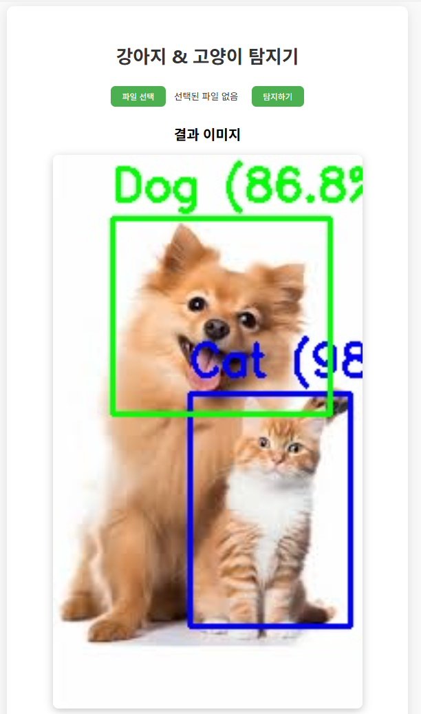

# 🐶🐱 PyTorch Dog vs Cat Object Detection

> Vibe Coding 방식으로 개발한 **PyTorch 기반 미리 학습된 Faster R-CNN 모델**을 활용하여 강아지와 고양이 이미지를 객체 탐지하는 프로젝트입니다.

---

## 📌 프로젝트 개요
- PyTorch를 이용한 CNN 모델 구현
- **Vibe Coding** 방식을 적용하여 직관적이고 유연하게 모델 설계 및 학습 진행
- pretrained=True 옵션을 통해 COCO 데이터셋으로 미리 학습된 Faster R-CNN 모델 사용.
  사람, 강아지, 고양이 등 COCO 클래스에 대해 학습된 가중치(weights)를 사용하기 때문에 별도로 학습시키지 않아도 바로 객체 탐지가 가능
  기본적으로 바로 탐지 가능 → 정확도를 높이려면 추가 학습(fine-tuning) 필요

---

## 🛠 기술 스택
- **Framework** : PyTorch, Torchvision, FastAPI
- **Language** : Python 3.11
- **Tools** : VS Code
- **Visualization** : OpenCV
- **Web** : FastAPI, Jinja2, HTML/CSS
---

## 📦 설치된 패키지 버전 (현 프로젝트 기준)

| 패키지 | 버전 |
|--------|------|
| fastapi | 0.117.1 |
| uvicorn | 0.37.0 |
| torch | 2.6.0+cu124 |
| torchvision | 0.21.0+cu124 |
| torchaudio | 2.6.0+cu124 |
| opencv-python | 4.12.0.88 |

## ✨ 주요 기능
- 웹에서 업로드한 이미지에서 강아지/고양이 객체 탐지
- COCO 사전 학습 Faster R-CNN 모델 사용 (pretrained=True)
- 탐지된 객체에 바운딩 박스와 클래스명 표시
- 결과 이미지 저장

---

## 🖼 결과 이미지 예시
아래 이미지는 모델 추론 후 결과를 나타냅니다.



---

## 🚀 실행 방법

### 1. 환경 설정
```bash
git clone https://github.com/your-username/pytorch-dogcat-classifier.git
cd pytorch-dogcat-classifier

# 가상환경 생성 및 활성화
python -m venv venv
# Windows
.venv\Scripts\activate
# macOS / Linux
source .venv\Scripts\activate

# 필수 라이브러리 설치
pip install fastapi uvicorn[standard] opencv-python

# NVIDIA GPU가 설치되어 있다면
nvidia-smi

# 예: CUDA 12.4일 경우
pip install torch torchvision torchaudio --index-url https://download.pytorch.org/whl/cu124

# ⚠️ 만약 GPU가 없거나 CPU만 사용하려면 +cpu 버전으로 설치하세요:
pip install torch torchvision torchaudio --index-url https://download.pytorch.org/whl/cpu
```
### 2. FastAPI 서버 실행 방법
프로젝트의 가상환경(venv)에 진입한 후 아래 명령어로 서버를 실행합니다.  
서버가 실행되면 기본적으로 `http://127.0.0.1:8000`에서 웹 페이지를 확인할 수 있습니다.

```bash
# 가상환경 진입 후 FastAPI 서버 실행
uvicorn app:app --reload
--reload 옵션: 코드 변경 시 자동으로 서버 재시작  
http://127.0.0.1:8000 안내: 브라우저에서 확인 가능  
```

## 🔧 향후 업그레이드 아이디어

현재 프로젝트는 FastAPI와 사전 학습된 Faster R-CNN 모델을 활용해 웹에서 이미지 추론 기능만 제공하지만, 아래와 같이 확장할 수 있습니다:

1. **DB 연동**
   - 학습 데이터, 이미지, 탐지 결과 등을 SQL 기반 데이터베이스(MySQL, PostgreSQL 등)에 저장
   - 모델 버전, 파라미터, 학습 기록을 DB에 관리하여 재현성 확보

2. **학습/평가 기능 추가**
   - 영상 데이터 전처리 및 데이터 증강(Augmentation) 기능 구현
   - 학습 손실(loss), 정확도(accuracy) 등의 성능 지표를 기록 및 시각화
   - Kaggle Dogs vs Cats 등 사용자 데이터로 모델 fine-tuning 지원

3. **영상 처리 기능 확장**
   - OpenCV 기반 영상 전처리 기능 추가 (예: 리사이징, 필터링, 객체 추적)
   - 웹에서 업로드한 영상/비디오 파일을 대상으로 강아지/고양이 탐지

4. **다양한 AI 모델 적용**
   - CNN 외 Vision Transformer 기반 객체 탐지 모델 등 다양한 모델 실험
   - 멀티모델 비교 및 성능 향상 가능

5. **웹 대시보드**
   - DB와 연동하여 학습 기록, 추론 결과, 성능 지표를 시각화
   - 모델 관리 및 재학습 진행 상태 모니터링

